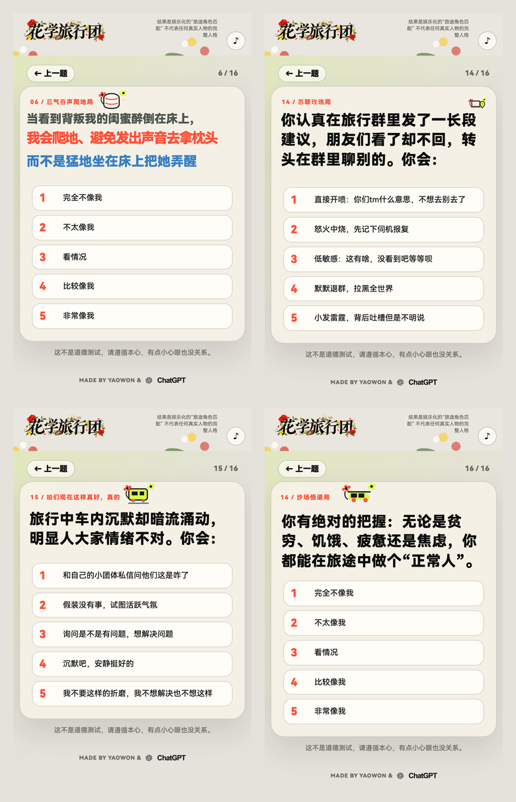

# Quiz Studio

[English](#english) · [快速开始](#快速开始) · [贡献](CONTRIBUTING.md)

> 一个面向移动端人格、角色匹配、内容互动与粉丝向测试的开源 Skill 和无框架 starter。它帮助人和 AI 把“想做一个测试”变成可编辑、可验证、可发布的网页；不把娱乐测试包装成心理诊断。

## 中文说明

做一个测试，难的通常不只是写几道题。你要决定结果是什么、题目怎样区分结果、手机上每一行字和每一张图放在哪里、用户改过的位置怎样准确出现在正式页，以及结果图能不能真的保存。

Quiz Studio 把这些环节放进一套很小的代码和协作流程里。它不替你决定主题、文案或审美；你仍然需要提供方向、题目、素材和审核。它做的是让 AI、创作者和代码使用同一份配置协作，少在“工作台是对的、正式页却不对”这种问题上来回消耗。

### 它怎样实现

- **一份配置。** `quiz-config.js` 同时驱动正式答题页、结果页、分享图和工作台草稿。工作台通过 iframe 和 `postMessage` 操作正式渲染器，不维护另一套长得相似的预览。
- **页面是可调的图层。** 文字行、图片、矢量小图、选项、页脚和页面高度都有独立配置。改页面长度不会顺带缩放人物图；红蓝字也可以分别对齐和移动。
- **计分是可检查的。** 题目答案和结果画像都用显式维度与向量表示；starter 提供校准路径、并列规则和随机模拟，帮助发现“看起来像 A，最后却总算成 B”或根本到不了的结果。
- **发布前验证真实交互。** starter 会检查配置结构和计分路径；流程还要求按实际手机宽度截图，并验证返回上一题、选项切换、保存结果图、音乐开关等运行时行为。
- **导出不只是假按钮。** 结果图使用 Canvas 生成可见预览，再提供用户主动点击的下载入口；素材跨域或浏览器限制会有可见的降级提示。

技术上，它只使用 HTML、CSS、JavaScript、Python 和 Node 标准库：原生 DOM/CSS、Pointer Events、Canvas、localStorage 与 `postMessage`。不需要指定模型、前端框架或云服务，因此可以和 Codex、Claude Code、Cursor、Gemini、ChatGPT 或人工开发流程一起使用。

### 这个项目希望帮你省掉什么

这是从一次实际的移动端测试项目中整理出来的。我们把反复踩到的坑写成了工作流和故障图谱：

- 不用把工作台当成另一套页面；正式页就是工作台预览的对象。
- 不因一个局部遮挡就全局重排已经确认的构图。
- 不把透明 PNG/SVG 的外框误当作实际画面范围。
- 不让结果页高度、人物尺寸、选项区域和页脚绑在一起。
- 不把“结构校验通过”误说成“手机上看起来没问题”。

如果你已经想好了主题、结果类型、题目方向，并能提供或确认文本、图片、logo、音乐等素材，这个 Skill 可以帮助你更快地完成提问、计分、排版、调试和上线前验收。需要多轮审美协调的部分仍然需要人来判断；它的目标是让这种协调发生在一份可追踪、可导出、可复现的配置上。

### 案例：一个移动端角色匹配测试

下面的案例使用 Quiz Studio 的同一配置、工作台和截图验收流程制作。图片用于展示页面结构和编辑方式，不构成对其中真实人物的心理判断，也不授予案例素材的再使用权。

| 封面 | 题目页 |
| --- | --- |
|  |  |

| 人物结果页 | 分享结果图 |
| --- | --- |
|  |  |

## 快速开始

```bash
git clone https://github.com/Yaowon/quiz-studio.git
cd quiz-studio

python3 scripts/create-project.py /absolute/path/my-quiz
node scripts/validate-persona-quiz.mjs /absolute/path/my-quiz
python3 -m http.server 4173 --directory /absolute/path/my-quiz
```

打开 `http://localhost:4173/design-studio.html`。工作台草稿只保存在浏览器本地；确认排版后，导出 JSON，再把确认版本写回 `quiz-config.js` 后发布。

建议的协作顺序：

1. 说明用途、受众、结果类型、内容来源、边界、审核人、素材版权、部署和数据规则。
2. 先定义可观察的区分维度，再写题目和结果文案；不要反过来用结果名硬凑题目。
3. 为每道题记录它区分什么行为、每个选项怎样赋分，以及为什么。
4. 先跑校准路径和模拟，再开始视觉排版。
5. 在实际手机宽度逐页截图；发现问题时只改被点名的图层，并保留其他已确认的位置。
6. 最后分别确认结构、计分、视觉、交互、素材权利和隐私，而不是把它们混成一次“看起来没问题”。

详细的 agent 协作说明在 [SKILL.md](SKILL.md)。设计与工作台架构、题目调研、计分、故障排查、QA 和模型兼容性说明在 [references/](references/)；针对“工作台和正式页为什么不一样”、局部修改怎样不伤及整页的具体流程见 [对齐协议](references/alignment-protocol.md)。

## 范围与限制

- 这是娱乐、内容互动、教育和反思工具，不是临床或心理诊断工具。
- AI 生成图适合探索风格；涉及准确文字、logo、人物、数字和锁定布局的最终资产，优先使用用户提供或单独确认的素材。
- 公开发布前，项目拥有者需要确认肖像、音乐、商标、引用、素材、统计和部署合规。
- 手机浏览器不能被强制自动播放有声音乐；应默认静音，并让用户主动开启。
- Canvas 导出受跨域规则限制；最终图片最好与页面放在同一项目或明确配置 CORS。

欢迎贡献新的风格预设、布局层类型、校准用例、故障复盘和不同模型的使用记录。请先阅读 [CONTRIBUTING.md](CONTRIBUTING.md)。

---

<a id="english"></a>

# English

Quiz Studio is an open-source Skill and framework-free starter for mobile-first personality, role-match, fandom, and content-interaction quizzes. It helps a creator and an AI turn an idea into an editable, testable, publishable web quiz. It is not a psychological or clinical diagnostic tool.

Building a quiz is not only about writing questions. Someone still needs to decide the outcomes, provide the copy and assets, review the tone, and make aesthetic calls. Quiz Studio keeps the AI, the editor, and the production page working from the same configuration, so those decisions do not get lost between a workbench and a published page.

## How it works

- `quiz-config.js` is the shared source for the formal renderer, result page, share-card exporter, and workbench draft.
- The workbench embeds the formal renderer in an iframe and updates it with `postMessage`; it is not a separate look-alike preview.
- Text lines, media, small SVG scenes, options, footer, and page height are independent layers. A page-height change does not resize a portrait or pin the options.
- Explicit answer vectors, result profiles, calibration paths, tie behavior, and simulation make scoring inspectable before visual polish.
- The starter uses plain HTML, CSS, JavaScript, Python, and Node standard libraries: native DOM/CSS, Pointer Events, Canvas, local storage, and `postMessage`. No specific model, UI framework, or cloud host is required.

The repository also records practical failure modes: stale workbench configs, copied renderers, transparent image padding mistaken for content, global fixes that break approved layouts, hidden results, and export buttons that do not produce a downloadable image.

## Use it when

You have a direction, result types, question ideas, and enough approved copy or assets to make decisions. The Skill can guide intake, scoring, layout, debugging, and release checks. It does not replace editorial judgment or art direction; it makes that collaboration more traceable and easier to repeat.

```bash
git clone https://github.com/Yaowon/quiz-studio.git
cd quiz-studio
python3 scripts/create-project.py /absolute/path/my-quiz
node scripts/validate-persona-quiz.mjs /absolute/path/my-quiz
python3 -m http.server 4173 --directory /absolute/path/my-quiz
```

Open `http://localhost:4173/design-studio.html`, export the approved JSON configuration, merge it into `quiz-config.js`, then publish.

## Scope and limits

- For entertainment, education, reflection, and creative engagement; not for clinical diagnosis.
- Use user-supplied or separately approved final assets for exact lettering, logos, likenesses, numbers, or locked layouts.
- Asset rights, privacy, analytics, hosting, and publication compliance remain the project owner's responsibility.
- Audible autoplay is not reliable on mobile; start muted and let users opt in.
- Canvas export needs same-origin or CORS-enabled images.

Contributions are welcome: style presets, layer types, calibration cases, failure reports, and notes on using the Skill with different models. Read [CONTRIBUTING.md](CONTRIBUTING.md) first.

## License

[MIT](LICENSE).
